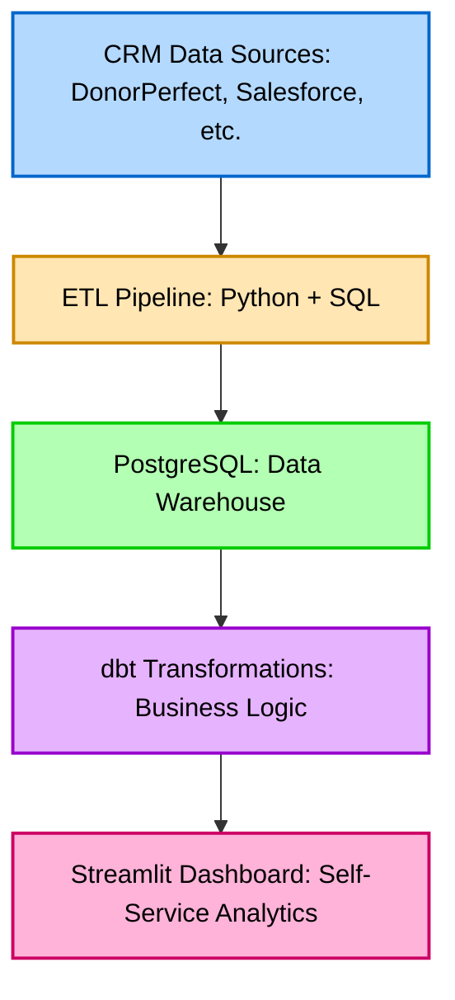

# DataBridge: Nonprofit Analytics Framework

An open-source data pipeline and analytics framework for nonprofit organizations.

## Overview

An open-source analytics framework that unifies fragmented nonprofit donor data into actionable insights for fundraisers.

**Problem:** 
Nonprofits struggle with donor data scattered across CRMs, email platforms, payment processors, and spreadsheets. Fundraisers can't easily answer "How is my portfolio performing? Why?"

**Solution:** DataBridge consolidates multiple data sources into a unified analytics platform with self-service dashboards.

---

## Quick Start
```bash
# Clone repository
git clone https://github.com/eliskamd/nonprofit-data-pipeline.git
cd nonprofit-data-pipeline

# Set up Python environment
python -m venv venv
venv\Scripts\activate  # Windows
source venv/bin/activate  # Mac/Linux

# Install dependencies
pip install -r requirements.txt

# Generate sample data
python generate_sample_data.py

# Set up database (requires PostgreSQL installed)
python database_setup.py

# Load data
python load_data.py
```

**Result:** 6,010 records loaded into PostgreSQL, ready to query!

---

## Current Status

**Completed (Weeks 1-2):**
- Synthetic data generation (1,000 donors, 5,000 donations)
- PostgreSQL database with normalized schema
- ETL pipeline with batch loading
- Data validation and quality checks

**In Progress (Week 3):**
- dbt transformation layer
- Monthly donor consolidation logic

**Upcoming (Weeks 4-8):**
- Metrics layer (retention, LTV, ROI)
- Streamlit dashboard
- Portfolio holder reports

---

## Architecture
```
Data Sources → ETL Pipeline → PostgreSQL → dbt → Dashboards
(CSV files)    (Python)       (Warehouse)  (Transform) (Streamlit)
```

**[Full Architecture Documentation →](docs/ARCHITECTURE.md)**

---
## How It Works



---

## Key Features

### Current Implementation
- **Synthetic Data Generator:** Create realistic nonprofit data for testing
- **Batch ETL:** Efficient data loading with integrity checks
- **Normalized Schema:** Proper relational design with foreign keys
- **Performance Optimized:** Indexes on frequently-queried columns

### Planned Features
- **Monthly Donor Consolidation:** Unify recurring donors across systems
- **Portfolio Analytics:** Track fundraiser performance
- **Campaign Comparison:** Side-by-side ROI analysis
- **YOY Trends:** Year-over-year giving patterns

---

## Documentation

- [Architecture Overview](docs/ARCHITECTURE.md)
- [Data Dictionary](docs/DATA_DICTIONARY.md)
- [Performance Guide](docs/PERFORMANCE.md)

---

## Tech Stack

| Layer | Technology | Purpose |
|-------|------------|---------|
| Language | Python 3.13 | ETL & data processing |
| Database | PostgreSQL 17 | Data warehouse |
| Future: Transform | dbt Core | Business logic layer |
| Future: Dashboard | Streamlit | Self-service analytics |

---

## Author

Eliška Merchant-Dest
- Building analytics infrastructure for global impact
- Background: Mathematics, Environmental Science, Data Analysis
- LinkedIn: [linkedin.com/in/eliskamd](https://www.linkedin.com/in/eliskamd)
- Portfolio: [eliskamerchantdest.com](https://eliskamerchantdest.com)
- Email: e.merchantdest@gmail.com
```